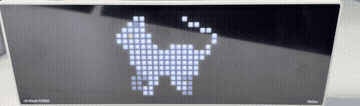

# TC002 桌面像素宠物（灰猫）

[](https://my.home-assistant.io/redirect/blueprint_import/?blueprint_url=https%3A%2F%2Fgithub.com%2FUlanziTechnology%2FUlanzi-U-Clock-TC002%2Fblob%2Fmain%2Fapps%2Fmqtt%2Fpet%2Fblueprint.yaml)

## 简介

把 TC002 变成一只桌面像素宠物（浅灰虎斑猫）。Blueprint 监听一个 HA 实体，按状态切换动作：

| 状态值（可配置） | 动作 |
|---|---|
| `idle` | 站立 + 轻微呼吸 |
| `walk` | 散步（横向踏步） |
| `run` | 奔跑 |

猫居中显示在 52×16 屏幕上。

## 预览

设备渲染画面（52×16 像素）：


真机实拍：



## 配置参数

- **状态实体**：提供当前状态的 HA 实体（如 `input_select.pet`）。
- **TC002 Custom App MQTT topic**：`[PREFIX]/custom/[APP_NAME]`，默认 `ulanzi_1bf6/custom/pet`。
- **显示时长 / 保留消息 / idle·walk·run 状态值**。

## MQTT

- **Topic**：`[PREFIX]/custom/pet`（示例 `ulanzi_1bf6/custom/pet`）
- **Payload**（按状态切换内嵌的 GIF）：

```json
{"duration": 3600, "text": [], "image": [{"data": "data:image/gif;base64,...", "position": [0, 0]}], "draw": []}
```

## 素材与许可证

- 猫素材：**Shepardskin — "Cat Sprites"（CC0 / 公共领域）**，来源 <https://opengameart.org/content/cat-sprites>，已重上色为浅灰虎斑。CC0 与本仓库 GPL-3.0 兼容。
- 重新生成素材：`python3 lab/build_pet.py`（需 Pillow）。
- Blueprint 本身：GPL-3.0-or-later。

## 已知问题

- TC002 收到 Custom App 更新后不一定自动切到该 App。
- 设备字体/渲染为设备端行为；payload 帧格式与 HTTP Custom App 一致。
