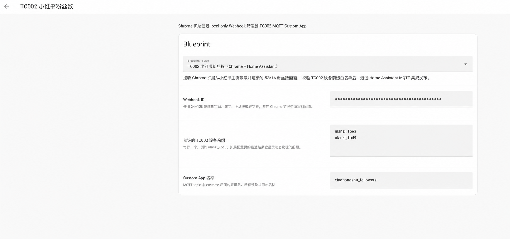
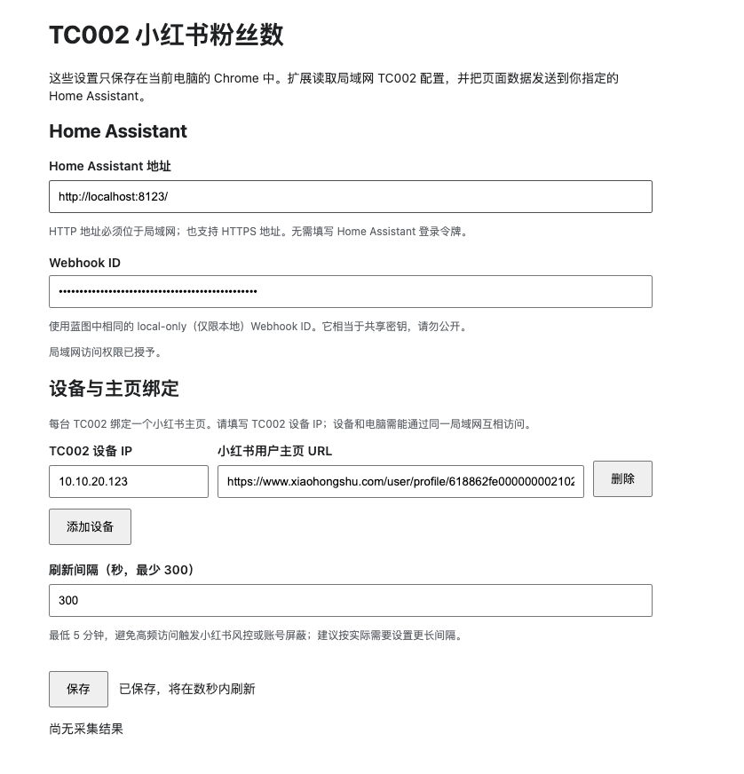
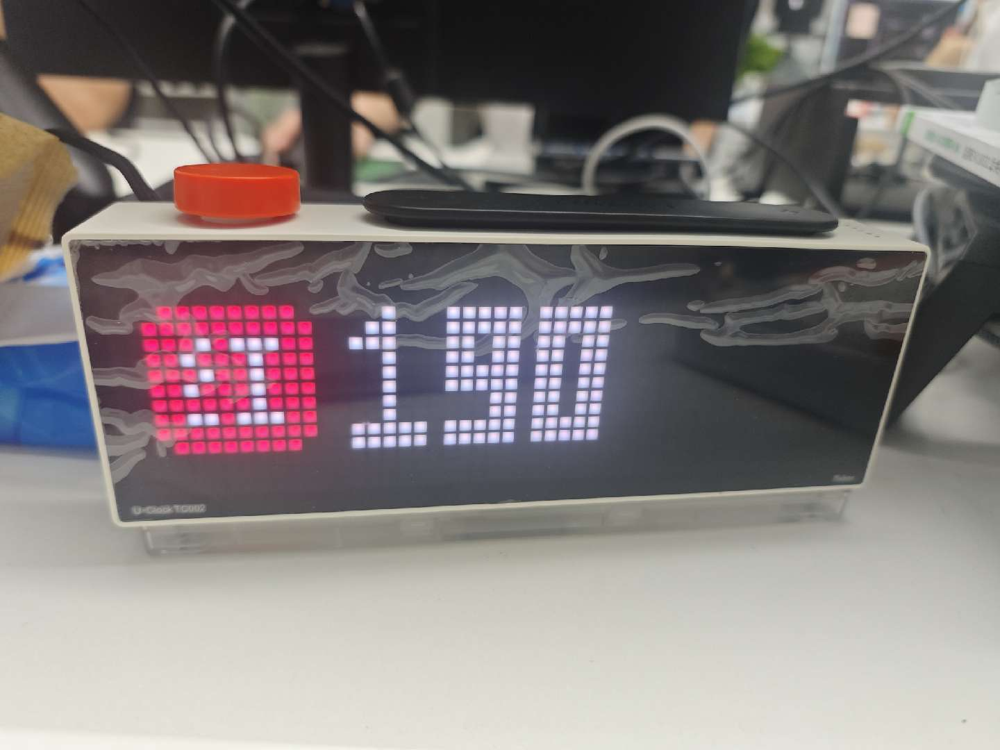

# TC002 小红书粉丝数（Chrome + Home Assistant）

Chrome 扩展使用当前浏览器登录会话读取指定小红书主页上已经显示的粉丝数，在浏览器内生成固定像素矩阵的 52×16 PNG，再通过 Home Assistant Webhook 和 MQTT 集成发布到一台或多台 TC002。没有第三方采集云服务，不读取或导出 Cookie。

```text
小红书主页 → Chrome 扩展 → local-only HA Webhook → HA MQTT 集成 → TC002 Custom App
```

## 使用前提

必须使用 **Google Chrome 浏览器**，并提前在 Chrome 中登录小红书账号。扩展复用当前浏览器的登录会话读取用户主页上已经显示的粉丝数；扩展不会代替用户登录，也不会读取或上传 Cookie。

## 安装

- [快速安装](docs/QUICKSTART.md)
- [完整配置、隐私与故障排查](docs/README.md)
- [Chrome 扩展 ZIP](release/xiaohongshu-follower-counter-chrome-0.2.0.zip)
- [SHA-256](release/SHA256SUMS)
- [Home Assistant Blueprint](blueprint.yaml)

[](https://my.home-assistant.io/redirect/blueprint_import/?blueprint_url=https%3A%2F%2Fgithub.com%2FUlanziTechnology%2FUlanzi-U-Clock-TC002%2Fblob%2Fmain%2Fapps%2Fmqtt%2Fxiaohongshu-follower-counter%2Fblueprint.yaml)

一个 Blueprint 实例可服务多台设备。每台 TC002 在扩展中绑定一个小红书主页；Blueprint 只允许显式白名单中的设备前缀，并固定 `custom/` 后的应用名称。刷新间隔最低和默认值均为 5 分钟（300 秒）。

## 实际运行效果

已在 Chrome、Home Assistant 2026.6.3 和 TC002 实机上验证：扩展将不同小红书主页绑定到对应设备，Blueprint 校验设备前缀后，通过 MQTT Custom App topic 发布 52×16 像素画面。

| Home Assistant Blueprint | Chrome 扩展配置 |
| --- | --- |
|  |  |



- 渲染预览：[preview/demo.png](preview/demo.png)
- 真机素材要求：[preview/README.md](preview/README.md)
许可证：GPL-3.0-or-later。
